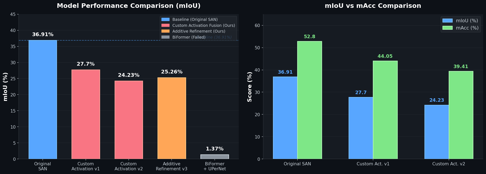

# 🌿 PlantSeg Enhanced Segmentation

**Enhanced Feature Fusion for Plant Semantic Segmentation Using Side Adapter Networks with Learnable Cross-Attention**

[](https://python.org)
[](https://pytorch.org)
[](https://github.com/open-mmlab/mmsegmentation)
[](LICENSE)

---

## 📌 Overview

This project tackles **fine-grained plant semantic segmentation** on the PlantSeg115 dataset (116 classes). We extend the [Side Adapter Network (SAN)](https://arxiv.org/abs/2302.12242) with novel fusion mechanisms and benchmark against Swin Transformer + UPerNet and BiFormer baselines.

### The Problem
The original SAN fuses features from a frozen CLIP encoder and a trainable side adapter using **simple element-wise addition**:

```
F_out = F_SAN + F_CLIP     ← Original SAN (that's it!)
```

This leaves significant room for improvement — especially for fine-grained tasks where 116 plant species may differ only in subtle texture or shape patterns.

### Our Solution
We introduce **learnable cross-attention fusion** with three novel components:

```
┌─────────────────────────────────────────────────────────┐
│  1. Learnable Temperature (τ)  — controls attention     │
│     sharpness; model learns when to focus vs. diffuse   │
│                                                         │
│  2. Feature Difference (D)     — |F_SAN − F_CLIP|       │
│     biases attention toward disagreement regions        │
│                                                         │
│  3. Gated Attention (G)        — σ(W_g · F_CLIP)        │
│     selectively filters CLIP features per channel       │
└─────────────────────────────────────────────────────────┘
```

---

## 🏗️ Architecture

### Original SAN Fusion
```
F_SAN ──────┐
            ├──(+)──→ F_out
F_CLIP ─────┘
```

### Custom Activation Fusion (Ours — Variant 1)
```
                    ┌──────────────────────────────┐
F_SAN ─────┬───→ Q │                              │
           │       │  A = Softmax( QKᵀ/√d · τ     │
           │       │              + β · D )        │
F_CLIP ────┼───→ K │                              │
           │───→ V │  O = A · V                    │
           │       │  G = σ(W_g · F_CLIP)          │
           │       └──────────────────────────────┘
           │                    │
           │              G ⊙ O │
           │                    │
           └──→ F_out = F_SAN + α · (G ⊙ O)
```

### Additive Refinement Fusion (Ours — Variant 3)
```
F_SAN ──────┐                   ┌─── Refinement Branch ───┐
            ├──(+)──→ F_base    │  (same cross-attention   │
F_CLIP ─────┘            │      │   as Variant 1)          │
                         │      └──────────┬───────────────┘
                         │                 │
                         └──→ F_out = F_base + α · (G ⊙ O)
                                            ↑
                                     α starts at 0.0
                              (guaranteed ≥ original SAN)
```

---

## 🔬 Mathematical Formulation

### Complete Fusion Formula

Given side adapter features **F_SAN** ∈ ℝ^(B×L×C) and CLIP features **F_CLIP** ∈ ℝ^(B×L×C):

**Step 1 — Feature Difference Detection:**
```
D = |F_SAN − F_CLIP|
```

**Step 2 — Temperature-Scaled Cross-Attention:**
```
Q = W_Q · F_SAN       (queries from side adapter)
K = W_K · F_CLIP      (keys from CLIP)
V = W_V · F_CLIP      (values from CLIP)

A = Softmax( (QKᵀ / √d) · τ + β · D )
```
- **τ** (learnable, init=1.0): Temperature — controls attention distribution sharpness
- **β** (learnable, init=0.1): Weights the feature difference bias
- **d**: Head dimension (embed_dims / num_heads)

**Step 3 — Gated Output:**
```
O = A · V                      (attention output)
G = σ(W_g · F_CLIP)            (per-channel gate)
F_out = F_SAN + α · (G ⊙ O)   (gated fusion)
```
- **α** (learnable, init=0.5 for v1, init=0.0 for v3): Output scaling
- **⊙**: Element-wise (Hadamard) product

---

## 📊 Results

<p align="center">
  
</p>

| Model Variant | mIoU (%) | mAcc (%) | Status | GPU Memory |
|:---|:---:|:---:|:---:|:---:|
| **Original SAN** (ViT-L/14) | **36.91** | **52.80** | ✅ Completed | ~13 GB |
| Custom Activation Fusion v1 | 27.70 | 44.05 | ✅ Completed | ~8 GB |
| Custom Activation Fusion v2 (tuned) | 24.23 | 39.41 | ✅ Completed | ~8 GB |
| Additive Refinement v3 | 25.26* | — | 🔄 Training | ~8 GB |
| BiFormer-Base + UPerNet | 1.37 | — | ❌ Failed | ~10 GB |
| Swin-Base + UPerNet | In progress | — | 🔄 Training | ~3.7 GB |

*\* Intermediate result — final metrics pending*

### Key Findings

1. **Simple fusion is surprisingly strong** — The original SAN's element-wise addition outperformed our cross-attention fusion by ~9 mIoU points
2. **Replacing vs. Refining** — Completely replacing the fusion (v1) is risky; the Additive Refinement approach (v3) is more principled
3. **Pretrained weights are critical** — BiFormer from scratch → 1.37 mIoU (effectively random chance for 116 classes)
4. **Negative results are valuable** — Understanding *why* complex fusion hurts helps guide future research

---

## 📁 Project Structure

```
PlantSeg-Enhanced-Segmentation/
│
├── models/
│   ├── decode_heads/
│   │   ├── san_head.py                    # Original SAN (baseline reference)
│   │   ├── san_custom_activation.py       # ⭐ Custom Activation Fusion (v1)
│   │   ├── san_additive_refinement.py     # ⭐ Additive Refinement Fusion (v3)
│   │   ├── san_enhanced_fusion.py         # Enhanced fusion (v0, experimental)
│   │   └── san_fusion_heads.py            # Multi-variant fusion heads
│   └── backbones/
│       └── biformer.py                    # BiFormer backbone (Bi-Level Routing)
│
├── configs/
│   ├── _base_/datasets/
│   │   └── plantseg115.py                 # Dataset configuration
│   ├── san/
│   │   ├── san_vit_l14_plantseg115.py     # Original SAN config
│   │   ├── custom_activation_fusion.py    # Custom Activation v1 config
│   │   ├── custom_activation_v2.py        # Custom Activation v2 config
│   │   ├── additive_refinement_fusion.py  # Additive Refinement config
│   │   └── enhanced_fusion.py             # Enhanced Fusion config
│   ├── swin/
│   │   └── swin_base_upernet_plantseg115.py  # Swin-Base + UPerNet
│   └── biformer/
│       └── biformer_base_upernet_plantseg115.py  # BiFormer + UPerNet
│
├── datasets/
│   └── plantseg115.py                     # PlantSeg115 dataset class (116 classes)
│
├── experiments/                           # 12 experiment configs with results
│   ├── exp1_lion/                         # Lion optimizer
│   ├── exp7_lion_cosine/                  # Lion + cosine schedule
│   ├── exp4_attn_fusion/                  # Attention-based fusion
│   ├── exp5_weighted_fusion/              # Weighted fusion
│   ├── exp6_multiscale_fusion/            # Multi-scale fusion
│   └── ...
│
├── tools/
│   └── train.py                           # Training entry point (MMSeg)
│
└── README.md
```

---

## ⚙️ Setup & Training

### Prerequisites
```bash
# Clone this repo
git clone https://github.com/Piyush12-kumar/PlantSeg-Enhanced-Segmentation.git
cd PlantSeg-Enhanced-Segmentation

# Install MMSegmentation (this project builds on top of MMSeg 1.x)
pip install -U openmim
mim install mmengine mmcv mmsegmentation

# Install additional dependencies
pip install ftfy regex open_clip_torch
```

### Dataset
Download the PlantSeg115 dataset and organize as:
```
data/plantseg/
├── images/
│   ├── train/
│   └── test/
└── annotations/
    ├── train/
    └── test/
```

### Training

**Original SAN (baseline):**
```bash
python tools/train.py configs/san/san_vit_l14_plantseg115.py \
    --work-dir work_dirs/san_baseline
```

**Custom Activation Fusion (our method):**
```bash
python tools/train.py configs/san/custom_activation_fusion.py \
    --work-dir work_dirs/custom_activation_v1
```

**Additive Refinement Fusion (our method):**
```bash
python tools/train.py configs/san/additive_refinement_fusion.py \
    --work-dir work_dirs/additive_refinement
```

**Swin-Base + UPerNet (strong baseline):**
```bash
python tools/train.py configs/swin/swin_base_upernet_plantseg115.py \
    --work-dir work_dirs/swin_upernet
```

---

## 🧠 Technical Deep Dive

### Why Custom Fusion Underperformed (Lessons Learned)

| Factor | Impact | Explanation |
|:---|:---:|:---|
| **Replacing vs. Adding** | High | v1 replaces original fusion entirely — model must relearn feature integration from scratch |
| **Too many new parameters** | Medium | Q, K, V projections + gate + output projection at each fusion point with small dataset |
| **Frozen CLIP backbone** | High | CLIP features are already well-structured; cross-attention adds unnecessary complexity |
| **Batch size constraints** | Medium | Training with batch_size=1 (GPU sharing) — cross-attention is more sensitive to this than simple addition |

### Why Additive Refinement is Better Designed

```python
# v1: REPLACES original (risky)
F_out = F_SAN + α * (G ⊙ O)           # Original fusion is GONE

# v3: PRESERVES original + adds refinement (safe)
F_base = F_SAN + F_CLIP                 # Original fusion preserved
F_out = F_base + α * (G ⊙ O)           # α=0 at init → starts as original SAN
```

The key insight: **if α learns to stay at 0, the model is exactly the original SAN.** This guarantees the model can never do worse than baseline — any learned refinement is strictly additive.

---

## 🔧 Training Configuration

| Parameter | SAN Variants | Swin + UPerNet |
|:---|:---:|:---:|
| Optimizer | AdamW | AdamW |
| Learning Rate | 2×10⁻⁵ | 6×10⁻⁵ |
| LR Schedule | PolyLR (power=1.0) | Linear warmup + PolyLR |
| Total Iterations | 160,000 | 160,000 |
| Batch Size | 1 (accumulate 4) | 1 (accumulate 4) |
| Crop Size | 512 × 512 | 512 × 512 |
| Mixed Precision | AMP | AMP |
| Gradient Clipping | max_norm=1.0 | max_norm=1.0 |

### Data Augmentation
- **RandomResize** (0.5×–2.0×) — scale invariance
- **RandomCrop** (512×512, cat_max_ratio=0.75) — spatial variety
- **RandomFlip** (p=0.5) — horizontal flip
- **PhotoMetricDistortion** — brightness, contrast, saturation, hue

---

## 📚 References

1. Xu et al., *"Side Adapter Network for Open-Vocabulary Semantic Segmentation"*, CVPR 2023
2. Liu et al., *"Swin Transformer: Hierarchical Vision Transformer using Shifted Windows"*, ICCV 2021
3. Xiao et al., *"Unified Perceptual Parsing for Scene Understanding"*, ECCV 2018
4. Zhu et al., *"BiFormer: Vision Transformer with Bi-Level Routing Attention"*, CVPR 2023
5. Radford et al., *"Learning Transferable Visual Models From Natural Language Supervision"*, ICML 2021

---

## 👤 Author

**Piyush Kumar** — B.Tech CSE, IIIT Guwahati (2023–2027)

[](https://www.linkedin.com/in/piyush-kumar-a365342a7/)
[](https://github.com/Piyush12-kumar)

*Project under the guidance of Dr. Nilkanta Sahu, IIIT Guwahati*

---

## 📝 Citation

If you find this work useful, please consider citing:

```bibtex
@misc{kumar2025plantseg,
  author       = {Kumar, Piyush},
  title        = {Enhanced Feature Fusion for Plant Semantic Segmentation 
                  Using Side Adapter Networks with Learnable Cross-Attention},
  year         = {2025},
  publisher    = {GitHub},
  howpublished = {\url{https://github.com/Piyush12-kumar/PlantSeg-Enhanced-Segmentation}},
  note         = {IIIT Guwahati, CS300 Project}
}
```

---

## 📄 License

This project is licensed under the MIT License. See [LICENSE](LICENSE) for details.

The codebase builds on [MMSegmentation](https://github.com/open-mmlab/mmsegmentation) (Apache 2.0) and [SAN](https://github.com/MendelXu/SAN) (MIT).
